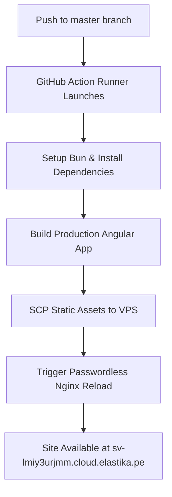

<div align="center">

# 🌐 Henrry AGC — Interactive Portfolio

**Senior Software Engineer & AI Integrator**  
Specialized in high-performance Full-Stack Systems, Cross-Platform Desktop Apps, and Microservice Architectures.

[](https://henrryagc.dev)
[](https://angular.io)
[](https://bun.sh)
[](LICENSE)

</div>

---

## 🚀 Overview

A responsive, high-performance portfolio application built with **Angular 22** and the modern build system. It serves as both a showcase for core engineering work and a demonstration of clean architecture, accessibility, and clean styling.

### Key Features
* ⚡ **Ultra-Fast Performance:** Powered by Angular 22 and Bun for optimized loading speed and bundle sizes.
* 🌓 **Dynamic Theming System:** Clean light and dark modes powered by CSS Custom Properties with zero flicker on loading.
* 🌐 **Bilingual Architecture:** Native translation handling (English / Español) powered by `@ngx-translate`.
* 📱 **Modern UI/UX Elements:** Fully custom bento-grid components, CSS-only browser mockup renders, and smooth cubic-bezier micro-animations.
* 🔄 **Automated Deployment:** Continuous integration pipeline using GitHub Actions to deploy static builds to a dedicated Ubuntu VPS.

---

## 🛠️ Portfolio Architecture & Technology Stack

| Layer | Component / Technology | Purpose |
|---|---|---|
| **Frontend Core** | **Angular 22** (Standalone Components, Signals) | State reactivity and component architecture. |
| **Runtime & Tooling** | **Bun** | Dependency management, scripts, and build execution. |
| **Styling Engine** | **SCSS** + CSS Variables | Dynamic styling, bento layouts, and animations. |
| **Internationalization**| **@ngx-translate** (EN / ES) | Dynamic localization. |
| **Deployment & CI/CD** | **GitHub Actions** + SCP/SSH Runner | Automated build and deployment directly to VPS. |
| **Hosting Platform** | **Ubuntu VPS** + **Nginx** Server | Reverse proxy and static file hosting. |

---

## 🚀 Highlighted Engineering Projects

### 🟣 [KipuView](https://github.com/ihenrryagc/KipuView) — Cross-Platform Text Grid Editor (Desktop)

> High-performance delimiter-separated text viewer and editor built with **Tauri v2** and **Angular 22**. Runs natively on macOS, Windows, and Linux.

[](https://tauri.app)
[](https://www.rust-lang.org)
[](https://angular.io)

* **Tabbed Workspace:** Features independent tabs that preserve delimiter types, file paths, and dirty states.
* **Asynchronous Parser:** Implements a line-by-line parser offloaded from the UI thread to handle multi-megabyte CSV/TSV files smoothly.
* **Direct File System Integration:** Modifies files in-place with native disk saving using Tauri's FS plugins.
* **Regex Engine:** Integrates regex search/replace with column-scoped filtering.

🔗 [View Repository](https://github.com/ihenrryagc/KipuView) · 🌐 [Live Demo](https://kipuview.web.app)

---

### 🟢 [GelatoPOS](https://github.com/ihenrryagc/GelatoPOS) — Real-Time Ice Cream POS & Inventory (Full-Stack)

> Complete POS and inventory system for retail stores, featuring smart stock tracking. Built with **Flask** and **Angular 20**.

[](https://flask.palletsprojects.com)
[](https://www.mysql.com)
[](https://www.docker.com)

* **Transactional Ordering:** Robust order module supporting multiple payment providers (cash, cards, e-wallets).
* **Inventory Deduction System:** Automatic transactional stock deduction mapping ingredient levels to sales.
* **Audit Control:** Includes shift closure cash calculators with physical denomination breakdowns.
* **Analytics Engine:** Interactive dashboards using Apache ECharts with clean PDF export modules.

🔗 [View Repository](https://github.com/ihenrryagc/GelatoPOS) · 🌐 [Live Demo](https://gelatopos.web.app)

---

### 🟠 [AppLaundry](https://github.com/ihenrryagc/AppLaundry) — Hybrid Enterprise Operations Suite (Full-Stack)

> Enterprise management app utilizing active-active replication, VPS/NAS hybrid structure, and automatic fallback. Built with **.NET 9** and **Angular 20**.

[](https://dotnet.microsoft.com)
[](https://mariadb.org)
[](https://www.cloudflare.com)

* **Operational Pipeline:** Live tracking of garments through complex states (received → washing → ready → delivered).
* **Hardware Integration:** Native thermal printer integration using low-level vendor driver DLLs.
* **Resilient Replication:** Active-active MariaDB replication between Cloud VPS and localized Synology NAS storage.
* **High Availability:** Custom .NET health probes executing client-side traffic redirection to localized NAS within 5 seconds during cloud outages.

🔗 [View Repository](https://github.com/ihenrryagc/AppLaundry) · 🌐 [Live Demo](https://applaundry.web.app)

---

### 🔵 [BYTESW](https://github.com/ihenrryagc/BYTESW) — Core Banking Microservices (Backend)

> Microservice infrastructure for managing corporate banking transactions. Built with **Spring Boot**, **Micronaut**, and **Angular**.

[](https://www.oracle.com/java)
[](https://spring.io/projects/spring-boot)
[](https://kubernetes.io)

* **Distributed Core:** Designed with highly concurrent Spring Boot and Micronaut services.
* **IAM & Security:** Keycloak-powered centralized authentication and granular role-based access control (RBAC).
* **DevOps Pipelines:** Automated testing and integration pipelines (Jenkins) executing blue-green deployments to AWS EKS clusters.

🔗 [View Repository](https://github.com/ihenrryagc/BYTESW) · 🌐 [Live Demo](https://bytesw-banking.web.app)

---

## 🛠️ Local Development

### Prerequisites
* [Bun Runtime](https://bun.sh) (v1.1 or higher recommended)

### Setup Instructions
1. **Clone the repository:**
   ```bash
   git clone https://github.com/Henrryagc/IPortfolio.git
   cd IPortfolio
   ```

2. **Install dependencies:**
   ```bash
   bun install
   ```

3. **Start the local development server:**
   ```bash
   bun run start
   ```
   Open `http://localhost:4200` to view the application in your browser.

4. **Run production build locally:**
   ```bash
   bun run build --configuration production
   ```

---

## 🚢 CI/CD Deployment Workflow

The repository includes a GitHub Action runner configured in `.github/workflows/deploy-vps.yml` which deploys on every push to `master`:



Detailed guides on setting up the VPS, Nginx virtual host, and SSH key permissions can be found in the [DEPLOY.md](file:///Users/ihenrryagc/IProjects/AngularWebApps/IPortfolio/DEPLOY.md) document.

---

## 📬 Contact & Links

* **Email:** [EMAIL_ADDRESS](mailto:[contact@henrryagc.dev])
* **Location:** Peru, Moquegua
* **Phone:** [PHONE_NUMBER](tel:+51927970759)
* **GitHub Portfolio:** [github.com/Henrryagc](https://github.com/Henrryagc)

---

<div align="center">

Made with ❤️ and Angular — © 2026 Henrry AGC

</div>
